```{r setup, include=FALSE}
options(htmltools.dir.version = FALSE)
knitr::opts_chunk$set(
  message = FALSE, 
  warning = FALSE, 
  error = FALSE, 
  echo = FALSE,
  fig.retina = 3)
```

```{r xaringan-themer, include=FALSE}
library(xaringanthemer)
solarized_light(
  text_font_family = list(google_font("Lato")),
)
library(tidyverse)
```

class: inverse middle
background-image: url(https://upload.wikimedia.org/wikipedia/commons/f/f8/Iris_virginica_2.jpg)
background-position: 100% 100%
background-size: 50%

# Give Your Statistician Colleague Iris Bulbs for Their House Warming!

## Di Cook <br> Monash University

### Joint Statistics Meetings <br> July 30, 2019

<br>
<br>
<br>
<br>
<br>
.footnote[Image credit: [Iris Virginica, Wikimedia Commons](https://upload.wikimedia.org/wikipedia/commons/thumb/f/f8/Iris_virginica_2.jpg/440px-Iris_virginica_2.jpg)]

---
class: middle

<table>
<tr> <td width="30%"> 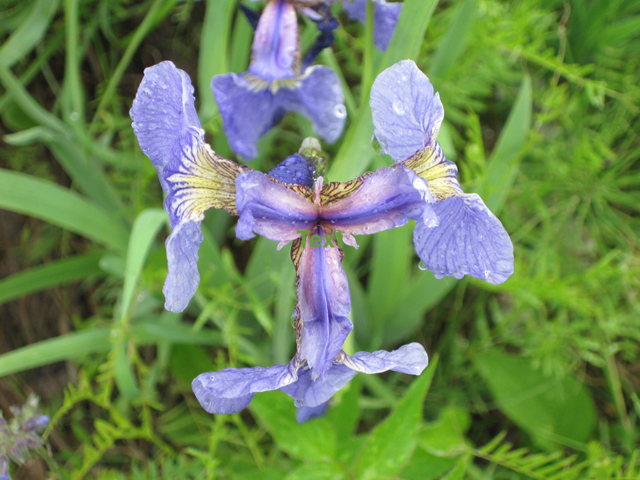 </td> <td width="30%">  </td> <td width="30%">  </td> </tr>
<tr> <td> Setosa .footnote[[Lady Bird Johnson Wildflower Center](https://www.wildflower.org/)]  </td> <td> Versicolor .footnote[[Wikimedia Commons](https://upload.wikimedia.org/wikipedia/commons/4/41/Iris_versicolor_3.jpg)] </td> <td> Virginica .footnote[[Wikimedia Commons](https://upload.wikimedia.org/wikipedia/commons/f/f8/Iris_virginica_2.jpg)]</td> </tr>
</table>

---

.pull-left[
# Where did this data come from?

The iris data was introduced to the data science community in [Fisher (1936)](https://onlinelibrary.wiley.com/doi/epdf/10.1111/j.1469-1809.1936.tb02137.x), in order to illustrate his new method "Fishers linear discriminant". 

*An era when the entire data table could be written on a single page.*
]
.pull-right[

]
---
.pull-left[
# Where did this data come from?

*"Table I shows measurements of the flowers of fifty plants each of the .orange[two species] Iris setosa and I. versicolor, found growing together in the same colony and measured by Dr E. Anderson, to whom I am indebted for the use of the data."* Fisher

.green[What about the third species?]
]
.pull-right[

]

---
# The original source 

.pull-left[
Edgar Anderson (1935) "The irises of the Gaspe Peninsula" Bulletin of the American Iris Society, **59**, 2-5.

<br>
<br>
<br>
<br>
.green[Original cannot be found.]
.footnote[[Bulletin of the American Iris Society](https://www.irises.org/pdf/AIS_Bulletin_Index_02-21-2015.pdf)]
]
.pull-right[
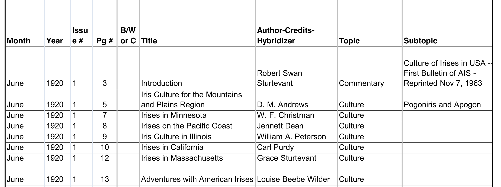

<br>
...
<br>

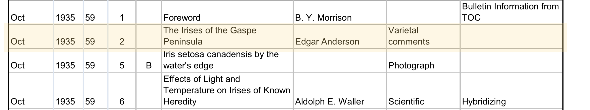
]


---

.pull-left[

.yellow[Anderson had been intrigued by I*. versicolor* and *I. virginica* for almost a decade.] 

Anderson (1928) The Problem of Species in the Northern Blue Flags. Iris versicolor and Iris virginica.

Anderson (1931) Internal Factors Affecting Discontinuity Between Species. 

]
.pull-right[
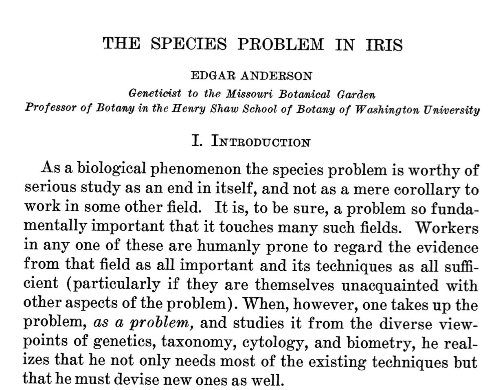

]

> .green["Although well provided with distinguishing characteristics, Iris versicolor and Iris virginica seem to be under a special curse so far as their recognition in the herbarium is concerned."] [Anderson, 1936](https://http://biostor.org/reference/11559)
 The Species Problem in Iris

<br>
*More than 50 pages long!*

---
# The motivation

.pull-left[

>"Although well provided with distinguishing characteristics, Iris versicolor and Iris virginica seem to be under a special curse so far as their recognition in the herbarium is concerned." .yellow[Anderson], 1936 The Species Problem in Iris
]
--

.pull-right[
>"The sample of the third species given in Table I, Iris virginica, differs from the two other samples in not being taken from the same natural colony as they were." .yellow[Fisher], 1936

]
---
# Outline

- Where did this data come from? (we've just covered this)
- Data:
    - Description - what is a sepal?
    - What was the original task/analysis? Is this the same as how it has been used since?
    - The new iris data using genomics
- The very amazing visuals from Anderson's original paper
- What does it mean to use the iris data, and how to get yourself into de-tox treatment


---
class: middle

.pull-left[
`r anicon::nia("Would you like framed iris photos?", anitype="hover", color="#686CA9", speed="slow")` 

`r anicon::nia("Stay tuned to take the quiz at the end of the presentation.", anitype="hover", color="#CFA118", speed="slow")` 
]
.pull-right[


.footnote[[Source: Wikimedia Commons](https://upload.wikimedia.org/wikipedia/commons/9/98/VanGoghIrises2.jpg)]
]
---
# Data description

Four variables: Sepal Length and Width, Petal Length and Width


.footnote[[Source: Suruchi Fialoke, October 13, 2016, Classification of Iris Varieties](http://suruchifialoke.com/img/ML/iris.png)]

---

.pull-left[


.footnote[[Wikimedia Commons](https://upload.wikimedia.org/wikipedia/commons/7/78/Petal-sepal.jpg)]

]
.pull-right[
<br>
<br>
Irises are weird!

<br>
<br>

The sepals have grown out of control, and are more spectacular than the petals. 

]
---
# Where to find the three species

<table>
<tr> <td width="30%"> 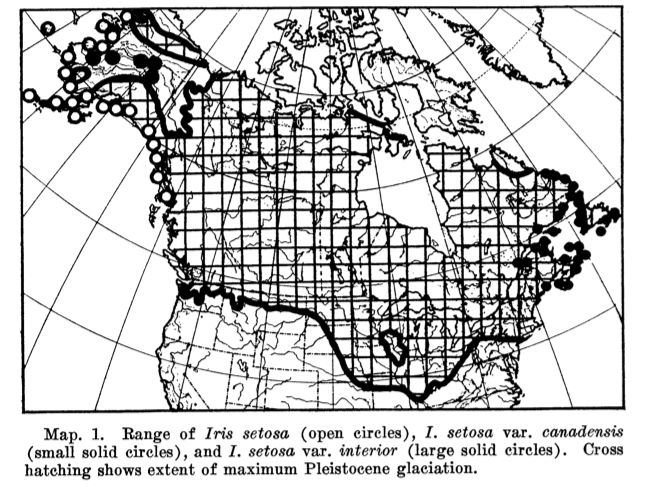 </td> <td width="30%"> 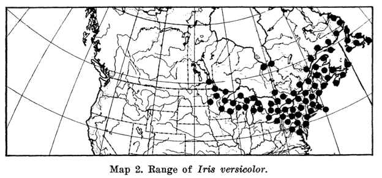 </td> <td width="30%"> 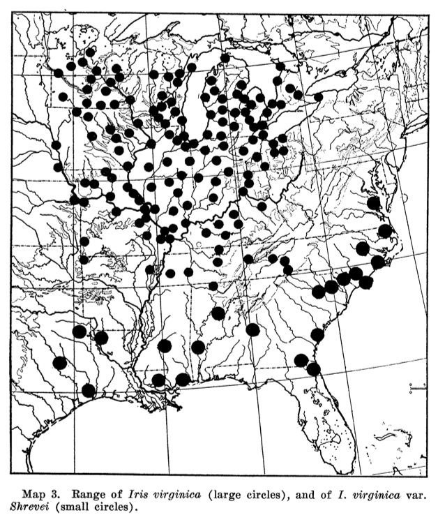 </td> </tr>
<tr> <td> Setosa   </td> <td> Versicolor </td> <td> Virginica </td> </tr>
</table>

---
.pull-left[
# Fisher's method

1. Fisher's linear discriminant between *setosa* and *versicolor*:
\begin{equation}
(\bar{x}_{setosa}-\bar{x}_{versicolor})^TS^{-1}_{pooled}
\end{equation}
2. Project *virginica* on this vector
]
--

.pull-right[
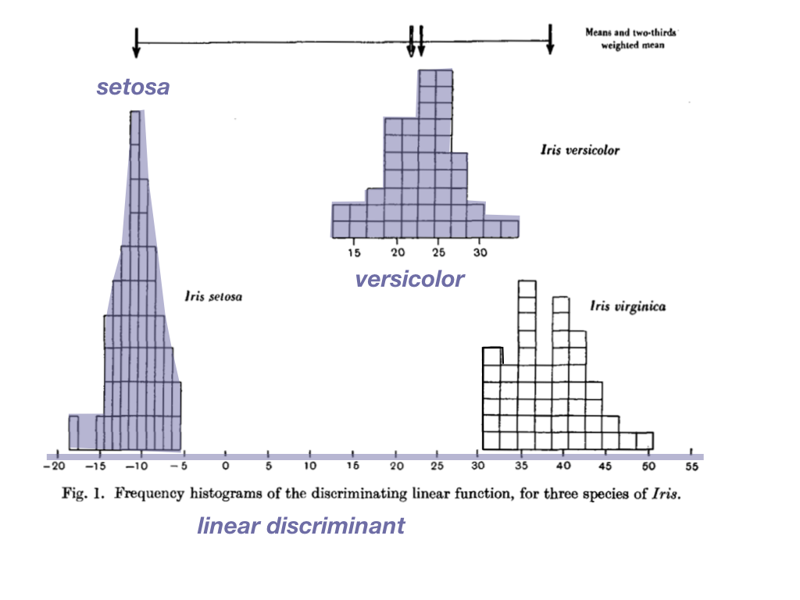
]


---
.pull-left[
# Fisher's method

1. Fisher's linear discriminant between *setosa* and *versicolor*:
\begin{equation}
(\bar{x}_{setosa}-\bar{x}_{versicolor})^TS^{-1}_{pooled}
\end{equation}
2. Project *virginica* on this vector
]

.pull-right[
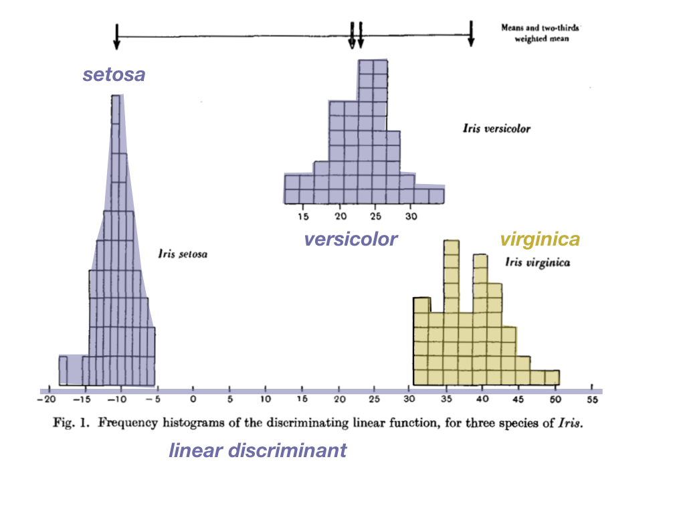
]

--

.yellow[*I. versicolor* is 2/3 of the distance between *I. setosa* and *I. virginica*. Which gives evidence for Anderson's claim that *I. versicolor* is a hybrid of the two.] 


---
# Do it: Fisher linear discriminant

Coefficients of linear discriminant (setosa, versicolor only) on standardised $^1$ measurements.

```{r}
library(MASS)
scale2 <- function(x, na.rm = FALSE) (x - mean(x, na.rm = na.rm)) / sd(x, na.rm)
iris_sub_std <- iris %>% filter(Species != "virginica") %>%
  mutate_if(is.numeric, scale2)
d <- lda(Species~., iris_sub_std)
d$scaling
```

Mostly, petal length and width needed to separate the (two) species. 

.footnote[1 Standardised variables allows direction interpretation of importance from the coefficients of the linear combination.]

---

```{r}
library(gridExtra)
d2 <- lda(Species~., filter(iris, Species != "virginica"))
d3 <- lda(Species~., filter(iris[,3:5], Species != "virginica"))
iris2 <- iris %>% mutate(d2 = as.matrix(iris[,1:4]) %*% as.matrix(d2$scaling),
                         d3 = as.matrix(iris[,3:4]) %*% as.matrix(d3$scaling))
p1 <- ggplot(iris2, aes(x=d2, fill=Species), colour="black") + 
  geom_histogram(alpha=0.8, breaks = seq(-6,16,1)) +
  scale_fill_brewer("", palette="Dark2") + xlab("Linear discriminant") +
  facet_wrap(~Species, ncol=1) + theme(legend.position="none")
p2 <- ggplot(iris2, aes(x=d3, fill=Species), colour="black") + 
  geom_histogram(alpha=0.8, breaks = seq(2,20,1)) +
  scale_fill_brewer("", palette="Dark2") + xlab("Only petals") +
  facet_wrap(~Species, ncol=1) + theme(legend.position="none")
grid.arrange(p1, p2, ncol=2)
```

---
class: inverse middle

`r set.seed(20190731); emo::ji("earth")` .yellow[Most contemporary use of the data focuses on building a classification model for] `r anicon::nia("all three species.", anitype="hover", color="#CFA118", speed="slow")`

<br>
<br>

`r anicon::nia("The task was never to distinguish between all three species!", anitype="hover", size=2, speed="slow")`

---
.pull-left[
# The new iris data

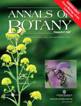

`r anicon::nia("Genomic analysis confirms Anderson's suspicions!", anitype="hover", size=1, speed="slow")`

[K. Yoong Lim, Roman Matyasek, Ales Kovarik, Andrew Leitch (2007) Parental Origin and Genome Evolution in the Allopolyploid Iris versicolor](https://academic.oup.com/aob/article/100/2/219/104457)

]
.pull-right[
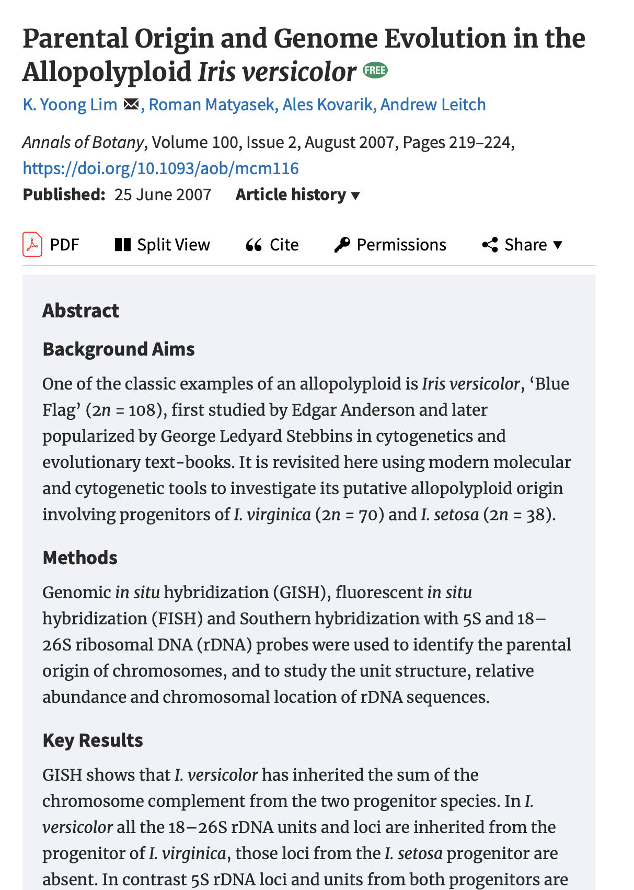

]

---

background-image: url("images/white_rabbit.jpg")
background-size: cover
class: inverse middle

## Anderson's original paper was filled with visual evidence, to support his thinking that *I.versicolor* is a hybrid. 

`r anicon::nia("Come down the rabbit hole with me", animate="falling", anitype="hover", size=2, speed="slow")`

---
.pull-left[
# Heatmap

Very popular plots for multivariate data. 

Show the data matrix, with rows and columns sorted by some criteria. Colour the cell according to the numerical value.

<br>
<br>

*Do you see three groups?*

]
.pull-right[
```{r fig.width=8, fig.height=12, out.width="100%"}
library(superheat)
superheat(iris[,1:4], scale=TRUE, 
          pretty.order.rows=TRUE, pretty.order.cols=TRUE,
          row.dendrogram = TRUE) 
```
]

---
.pull-left[
# Scatterplot matrix

Plot all pairs of variables, coloured by species.

There is a strong linear association between petal length and width, and the three species cluster separately along the association.

.yellow[Is it possible that only petal size matters to distinguish the species?]

]


.pull-right[
```{r fig.width=6, fig.height=6, out.width="100%"}
library(GGally)
ggscatmat(iris, columns=1:4, color="Species") +
  scale_color_brewer("", palette="Dark2") + 
  theme(legend.position="bottom")
```
]

.yellow[Maybe the Fisher linear discriminant is purely a linear combination of these two measurements.] 

---
# Parallel coordinate plot (*)

```{r fig.width=8, fig.height=4, out.width="90%", fig.align='center'}
ggparcoord(iris, columns=1:4, groupColumn=5, order="anyClass") +
  scale_color_brewer("", palette="Dark2") + 
  theme(legend.position="bottom")
```

---
# Icon (glyph) plot (*)

One observation (one row) = one icon

Variable values mapped to different features. 

---

.pull-left[

Star glyphs

```{r out.width="100%", fig.align='center'}
stars(iris[c(sort(sample(1:50, 5)), sort(sample(51:100, 5)), sort(sample(101:150, 5))),1:4], key.loc=c(3, 9), nrow=3)
```
]
--
.pull-right[

Chernoff faces

```{r out.width="100%", fig.align='center'}
library(TeachingDemos)
par(oma=c(0, 0, 0, 0), mai=c(0, 0, 0, 0))
faces(iris[c(sort(sample(1:50, 5)), sort(sample(51:100, 5)), sort(sample(101:150, 5))),1:4], nrow=3, ncol=5)
```

.footnote[1-height of face, 2-width of face, 3-shape of face, 4-height of mouth, 5-width of mouth, 6-curve of smile, 7-height of eyes, 8-width of eyes, 9-height of hair, 10-width of hair, 11-styling of hair, 12-height of nose, 13-width of nose, 14-width of ears, 15-height of ears]
]

---
# Tour

A movie of low-dimensional projections constructed in such a way that it comes arbitrarily close to showing all possible low-dimensional projections.
 
---
class: middle

```{r eval=FALSE}
# code to run the tour live
library(tourr)
library(RColorBrewer)
scale2 <- function(x, na.rm = FALSE) (x - mean(x, na.rm = na.rm)) / sd(x, na.rm)
iris_std <- iris %>% 
  mutate_if(is.numeric, scale2)
iris_std_mean <- iris_std %>% group_by(Species) %>%
  summarise_if(is.numeric, mean) # Compute means
clrs <- brewer.pal(3, "Dark2")
iris_std <- bind_rows(iris_std, iris_std_mean)
pch <- c(rep(3, 150), rep(20, 3))
col = clrs[as.numeric(iris_std$Species)]
# quartz()
animate_xy(iris_std[,1:4], col=col, pch=pch, axes="bottomleft")
```

<iframe src="iris_tour.html" width="1000" height="800" scrolling="yes" seamless="seamless" frameBorder="0"> </iframe>

---
class: inverse middle

# How did Anderson plot the data to support his thinking?

---
background-image: url("images/anderson_3D_parcoords.png")
background-size: contain
class: inverse middle

---
.pull-left[
# It's not a parallel coordinate plot. 

<br>
<br>

# It's an icon (glyph) plot, with lines connecting variable values. 

]
--
.pull-right[


# Anderson called them ideographs.

<br>
<br>

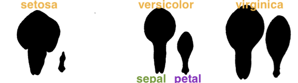

<!-- 
```{r}
iris_mean <- iris %>% group_by(Species) %>%
  summarise_all(mean) #%>%
  #gather("var", "val", Sepal.Length:Petal.Width) %>%
  #separate(var, c("type", "dim")) %>%
  #spread(type, val)
# Petal.Width, Sepal.Width -> Petal.Length, Sepal.Width ->
# Petal.Length, Sepal.Length -> Petal.Width, Sepal.Length ->
# Petal.Width, Sepal.Width
iris_mean_box <- bind_cols(
  Species = c(iris_mean$Species, iris_mean$Species, iris_mean$Species,
              iris_mean$Species, iris_mean$Species), 
  V1 = c(iris_mean$Petal.Width, iris_mean$Petal.Length, iris_mean$Petal.Length,
         iris_mean$Petal.Width, iris_mean$Petal.Width), 
  V2 = c(iris_mean$Sepal.Width, iris_mean$Sepal.Width, iris_mean$Sepal.Length,
         iris_mean$Sepal.Length, iris_mean$Sepal.Width))
iris_mean_box$Species <- factor(iris_mean_box$Species, levels=1:3, 
                                labels = levels(iris$Species))
ggplot(iris_mean_box) + 
  geom_polygon(aes(x=V1, y=V2, fill=Species, colour=Species), alpha=0.5) + 
  scale_fill_brewer("", palette="Dark2")  + 
  scale_colour_brewer("", palette="Dark2")
```
-->

]
---
class: inverse-nopad

.pull-left[
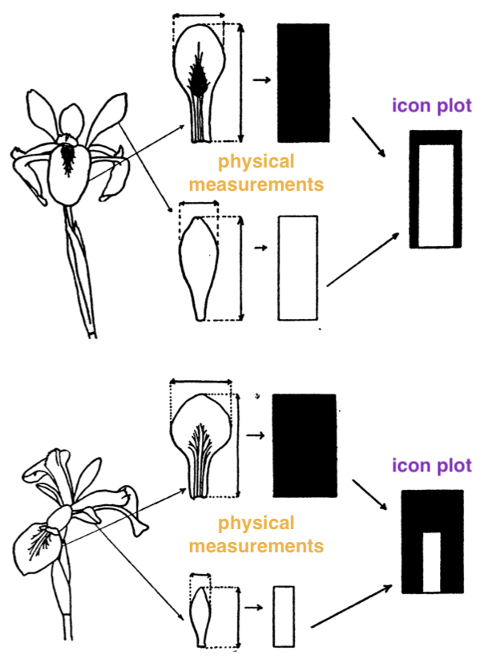
]
--
.pull-right[
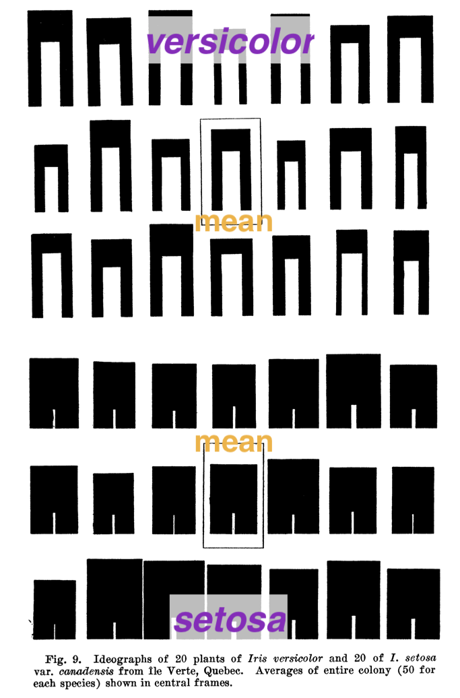
]

---

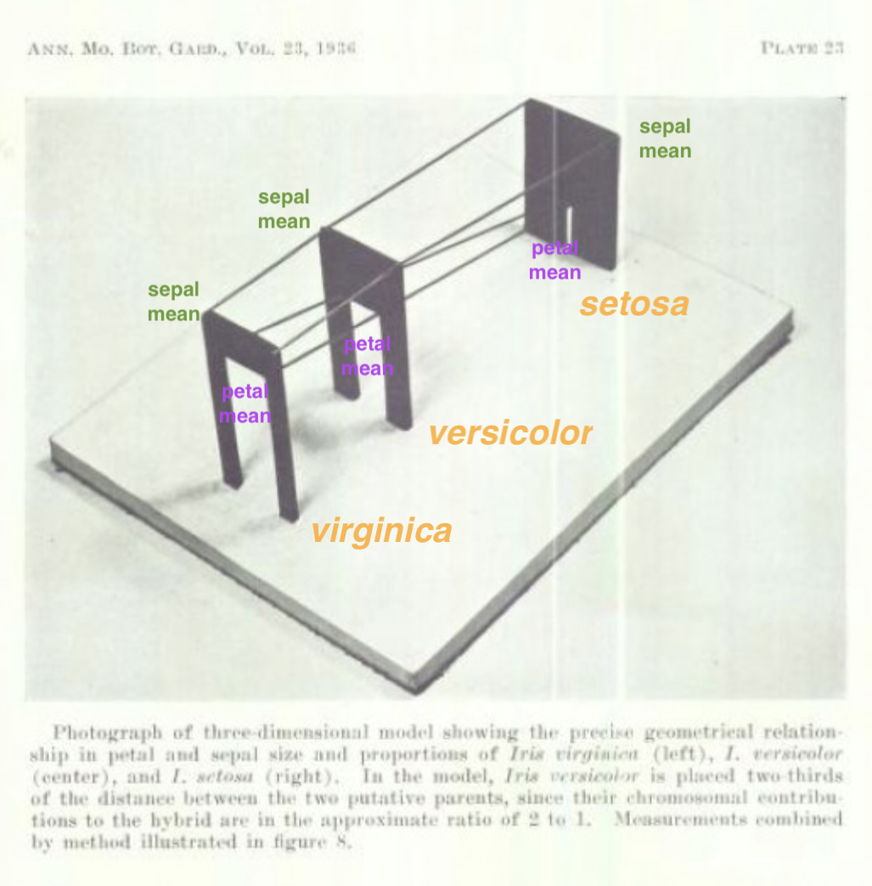


---

*People have been using this data for demonstrating supervised classification (and clustering and dimension reduction) for almost 100 years!*

**Why has it stuck so long?**

- pretty, and clean
- got a challenge (that's not actually a challenge!)
- as close to simulated data as you can get

*Small but not trivial. Simple but challenging. Real data. Fisher's reputation, although it's not his data. Tradition. Inertia. Continuity. You can find flower pictures to spell it out.* [– Nick Cox Nov 6 '13 at 19:07](https://stats.stackexchange.com/questions/74776/what-aspects-of-the-iris-data-set-make-it-so-successful-as-an-example-teaching)

---
# Other similar (abused) old data sets for classification/clustering

- Italian olive oils: Sicily is overlapped with other regions, overlapping classes
- Australian crabs: Strong positive correlation, heteroskedasity variance, overlapping classes
- Pima Indian diabetes: overlapping classes
- Hand-written digits: lots of classes, lots of data, overlapping classes

---
# New data science

.pull-left[
.yellow[Fresh and local] data, where you can. For me, this is:
- Pedestrian sensors
- Election and census
- Local sea levels
- Local temperatures
- Tennis Australia
]
.pull-right[
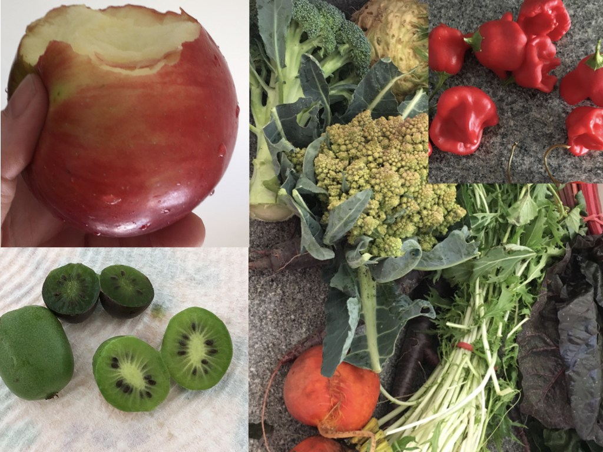
]
---
class: inverse middle

.pull-left[
# Use the iris data in your statistics and data science classes if you want to look like you are *not qualified* to teach the class
]
.pull-right[
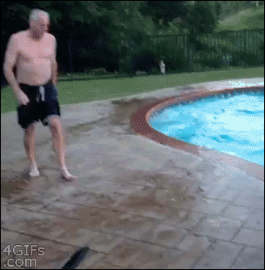

.footnote[[via GIPHY](https://giphy.com/gifs/fail-pool-falls-24MlC0gDHUAKY)]
]


---
class: inverse middle

.pull-left[
 
.footnote[[ia GIPHY](https://giphy.com/gifs/motion-fascinatingly-hopbike-mKDv2RJByxUZy0)]
]
.pull-right[
# Use the iris data in your publications if you want to look like your method *isn't useful*
]

---
class: inverse middle

.pull-left[
Thanks for listening!

Trivia quiz on the Iris data is here: [http://bit.ly/JSMiris2019](http://bit.ly/JSMiris2019)
]
.pull-right[


.footnote[[Source: Wikimedia Commons](https://upload.wikimedia.org/wikipedia/commons/9/98/VanGoghIrises2.jpg)]
]
---
class: middle
# Resources

- [Wikipedia iris data page](https://en.wikipedia.org/wiki/Iris_flower_data_set) editor [Indon](https://en.wikipedia.org/wiki/User:Indon), from which most of the information about the iris data is pulled.
- [Not Stats Chat](https://notstatschat.rbind.io/2016/12/30/theiris-data/)
- [Deep learning iris classifcation](https://www.kaggle.com/akashsri99/deep-learning-iris-dataset-keras) Are you kidding me! 
- [Nick Cox's response](https://stats.stackexchange.com/questions/74776/what-aspects-of-the-iris-data-set-make-it-so-successful-as-an-example-teaching) to "What aspects of the “Iris” data set make it so successful as an example/teaching/test data set".
- [Fishers article](https://onlinelibrary.wiley.com/doi/epdf/10.1111/j.1469-1809.1936.tb02137.x)
- [Phylogeny of the genus Iris](https://irisresearch.berkeley.edu/research/systematics/phylogeny-of-the-genus-iris-based-on-dna-sequence-data/)

---
class: middle
# Thanks

Slides created via the R package [**xaringan**](https://github.com/yihui/xaringan), with **iris theme** created from [xaringanthemer](https://github.com/gadenbuie/xaringanthemer).

The chakra comes from [remark.js](https://remarkjs.com), [**knitr**](http://yihui.name/knitr), and [R Markdown](https://rmarkdown.rstudio.com).

Slides are available at [https://dicook.org/files/JSM19/slides.html](https://dicook.org/files/JSM19/slides.html) and supporting files at [https://github.com/dicook/JSM19](https://github.com/dicook/JSM19).

<a rel="license" href="http://creativecommons.org/licenses/by-sa/4.0/"></a><br />This work is licensed under a <a rel="license" href="http://creativecommons.org/licenses/by-sa/4.0/">Creative Commons Attribution-ShareAlike 4.0 International License</a>.
